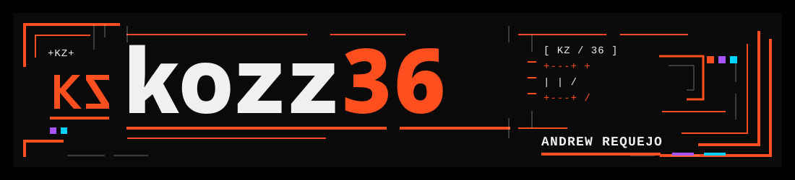

  

### Andrew Requejo

**Software Engineer | Applied AI & Engineering Automation**

I build software for engineering teams and day-to-day operations. My field experience helps me understand what people need, choose the right technologies, and take systems from requirements and architecture through development, testing, and validation.

[GitHub](https://github.com/kozz36) / [LinkedIn](https://www.linkedin.com/in/jose-requejo/) / [Email](mailto:andrew@qubytellc.com) / kozz.dev — in progress

Projects &amp; engineering approach

## Engineering approach

I use modern engineering workflows to build systems that are practical to operate, traceable, and maintainable. I choose the language, framework, and architecture for the constraints of the problem—whether performance, concurrency, simplicity, ecosystem fit, security, maintainability, operating cost, or delivery speed matter most.

AI accelerates how I explore, prototype and validate technologies, while architecture, trade-offs and final engineering decisions remain my responsibility.

## Technologies I use

- **Python and TypeScript** — backend services, web applications, workflow integrations, and delivery automation.
- **Go** — execution tooling, Git evidence workflows, concurrency-sensitive utilities.
- **Rust** — local-first desktop tooling, async integrations, and SQLite-backed components.
- **Supporting stack** — FastAPI, Vue 3, React, Next.js, Cloudflare Workers, D1, R2, SQLite, REST APIs, Docker, GitHub Actions, Pytest, Vitest, Playwright, axe-core, and Lighthouse CI.

## Featured products

### CNSIC Agent

A role-aware platform for field coordination, QA/QC, logistics, and project closeout. It turns messaging activity into structured daily operational context through backend, frontend, and AI integrations. The continuously running agent was tested with 10+ concurrent internal field groups; operational modules are being introduced in stages. *(Python, FastAPI, Vue 3, SQLite)*

### Telecom Vision

A staged workflow that converts telecom field imagery into structured, auditable engineering data through visual routing, extraction, domain reasoning, and deterministic reporting. Extraction is separated from reasoning and results are cached by image hash so retries do not repeat expensive visual processing. Validated routing behavior using an audit derived from 10,000+ real field images. *(Python, YOLO/ONNX routing, OCR, SQLite)*

### LUTRICON

An automotive catalog and business platform for product discovery, SEO, technical catalog content, and internal publishing workflows. It includes unit, integration, contract, and end-to-end testing, with accessibility and performance checks. *(TypeScript, Cloudflare Workers, D1, R2, Playwright, axe-core, Lighthouse CI)*

### VIBE Auto Sports

A public website and service-request platform for an automotive business. The public site is live; service-request intake is implemented and tested but not yet enabled in production while the product continues in development. *(Next.js, React, TypeScript, Cloudflare Workers, D1)*

